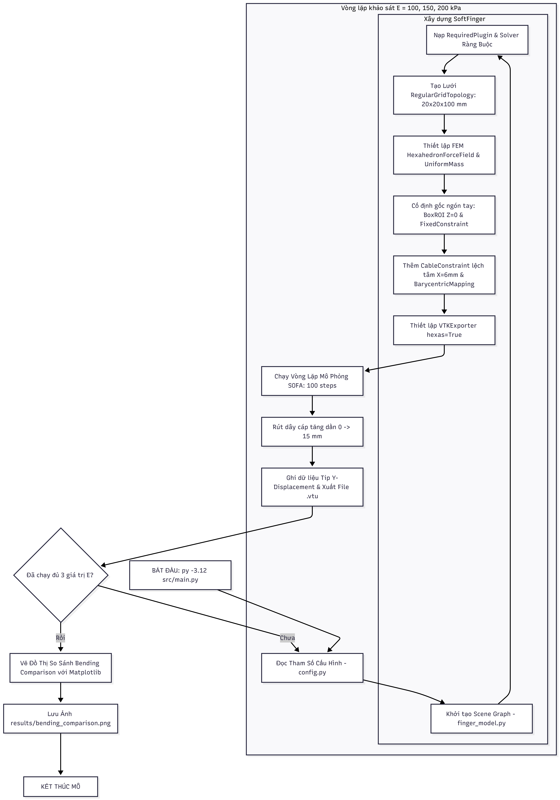

# 🤖 Mô Phỏng Ngón Tay Robot Mềm Dẫn Động Bằng Cáp (Cable-Driven Soft Finger Simulation)


Dự án xây dựng mô hình mô phỏng 3D phần tử hữu hạn (FEM) cho ngón tay robot mềm dẫn động bằng cáp rút lệch tâm sử dụng nền tảng SOFA Framework và plugin SoftRobots. Code được thiết kế tự động hóa hoàn toàn luồng khảo sát tham số cơ lý tính và xuất kết quả trực quan.

---

## 🎯 1. Mục tiêu mô phỏng
* **Xây dựng mô hình 3D:** Thiết lập ngón tay mềm khối chữ nhật (20 x 20 x 100 mm) cấu trúc lưới phần tử hình hộp (Hexahedron mesh).
* **Mô phỏng cơ cấu rút cáp:** Nhúng tuyến đường cáp lệch tâm (X = 6 mm) để tạo mô-men uốn cong khi kéo cáp hành trình 15 mm.
* **Khảo sát tham số:** Đánh giá ảnh hưởng của Mô-đun Young vật liệu (E = 100, 150, 200 kPa) đến khả năng biến dạng uốn và chuyển vị đầu mút (Tip Y-Displacement).
* **Tự động hóa:** Tự động lưu chuỗi dữ liệu biến dạng 3D (.vtu) và xuất đồ thị so sánh.

---

## 🧰 2. Giới thiệu ngắn gọn về phần mềm
* **SOFA (Simulation Open Framework Architecture):** Nền tảng mã nguồn mở chuyên biệt cho mô phỏng vật lý thời gian thực, tương tác cơ học vật thể mềm và y tế.
* **SofaPython3 & SoftRobots Plugin:** Thư viện mở rộng cho phép dựng Scene Graph, thiết lập mô hình vật lý và ràng buộc cáp kéo (`CableConstraint`) trực tiếp bằng ngôn ngữ Python.
* **ParaView:** Công cụ trực quan hóa dữ liệu 3D song song, dùng để phân tích trường ứng suất và biến dạng từ chuỗi file .vtu.

---

## 🎬 3. Hình ảnh / Video kết quả

### Chuyển động uốn cong thực tế (Simulation Animation) 

<p align="center">
  
</p>

### Đồ thị so sánh biến dạng đầu mút theo 3 mức Mô-đun Young (E)

<p align="center">
  
</p>
---

## 💻 4. Phiên bản phần mềm và thư viện
* **Operating System:** Ubuntu 22.04 LTS / Windows 11 (WSL2)
* **SOFA Framework:** v26.06 (compiled with SofaPython3 & SoftRobots plugin)
* **Python:** 3.10+
* **Python Libraries:**
  * `numpy` >= 1.22.0
  * `matplotlib` >= 3.5.0

---

## ⚙️ 5. Hướng dẫn cài đặt

### Bước 1: Clone Repository
```bash
git clone [https://github.com/your-username/soft-robot-finger-sofa.git](https://github.com/your-username/soft-robot-finger-sofa.git)
cd soft-robot-finger-sofa
```

### Bước 2: Tạo môi trường ảo và cài đặt thư viện
```bash
python3 -m venv venv
source venv/bin/activate  # Trên Windows: venv\Scripts\activate
pip install -r requirements.txt
```

### Bước 3: Cấu hình biến môi trường SOFA
Đảm bảo đường dẫn `PYTHONPATH` đã bao gồm thư viện `SofaPython3`:
```bash
export PYTHONPATH=$PYTHONPATH:/path/to/sofa/plugins/SofaPython3/lib/python3/site-packages
```

---

## 🚀 6. Lệnh chạy chương trình

Chỉ cần chạy file `main.py` duy nhất để thực thi toàn bộ kịch bản mô phỏng và xuất dữ liệu:

```bash
python src/main.py
```

*Chương trình sẽ tự động chạy nối tiếp 3 chu kỳ mô phỏng tương ứng với E = 100, 150, 200 kPa, lưu dữ liệu .vtu và tự động tạo đồ thị bending_comparison.png trong thư mục results/.*

---

## 📁 7. Cấu trúc Source Code

```text
soft-robot-finger-sofa/
├── README.md                 # Hướng dẫn chi tiết
├── requirements.txt          # Thư viện phụ thuộc
├── LICENSE                   # Giấy phép MIT
├── src/                      # Thư mục code chính
│   ├── config.py             # Tham số cấu hình
│   ├── finger_model.py       # Dựng SOFA Scene
│   └── main.py               # Chạy & vẽ đồ thị
├── results/                  # Thư mục kết quả
│   ├── deformation_demo.gif  # GIF mô phỏng
│   ├── bending_comparison.png# Đồ thị so sánh E
│   └── *.vtu                 # Dữ liệu 3D VTK
└── docs/                     # Tài liệu báo cáo
    ├── flowchart.png         # Sơ đồ quy trình
    └── presentation.pptx     # Slide trình chiếu
```

---

## 8. Flowchart mô phỏng

<p align="center">
  
</p>

### Liên hệ giữa Flowchart và Source Code:

1. **Khai báo mô hình & Plugin:** `finger_model.py` -> `rootNode.addObject('RequiredPlugin', ...)`
2. **Khai báo vật liệu & Tham số:** `config.py` & `finger_model.py` -> `HexahedronFEMForceField(youngModulus=E_val)`
3. **Điều kiện biên:** `finger_model.py` -> `BoxROI` và `FixedConstraint` tại mặt đáy $Z = 0$
4. **Khai báo Actuation:** `finger_model.py` -> `CableConstraint` lệch tâm $X = 6\text{ mm}$
5. **Thiết lập Solver:** `finger_model.py` -> `EulerImplicitSolver` & `SparseLDLSolver`
6. **Chạy mô phỏng:** `main.py` -> Vòng lặp `Sofa.Simulation.animate(root)` trong 100 bước
7. **Xuất & Trực quan hóa:** `VTKExporter` xuất file `.vtu` ra `results/` và `main.py` vẽ đồ thị `matplotlib`
---

## 📊 9. Các tham số chính

| Tên tham số | Ký hiệu / Tên Code | Giá trị / Đơn vị | Giải thích |
| :--- | :--- | :--- | :--- |
| **Kích thước ngón tay** | `length, width, height` | 100 x 20 x 20 mm | Hình học khối chữ nhật 3D |
| **Tổng khối lượng** | `totalMass` | 0.05 kg (50 g) | Phân bố đều qua UniformMass |
| **Hệ số Poisson** | `poissonRatio` | 0.45 | Đặc trưng vật liệu cao su/silicone không nén được |
| **Mô-đun Young** | `youngModulus` | 100, 150, 200 kPa | Dãy tham số khảo sát độ cứng vật liệu |
| **Vị trí tuyến cáp** | `cableAbsPosition` | X = 6 mm | Đặt lệch tâm để tạo hiệu ứng uốn |
| **Hành trình kéo cáp**| `displacement` | 15 mm | Độ rút cáp cực đại |
| **Bước thời gian** | `dt` | 0.01 s | Tích phân thời gian bộ giải ngầm EulerImplicit |

---

## 📈 10. Kết quả khảo sát tham số

* **E = 100 kPa (Vật liệu rất mềm):** Chuyển vị Y đầu mút đạt cực đại (~ -42 mm). Ngón tay uốn cong sâu nhất do độ cản biến dạng thấp.
* **E = 150 kPa (Vật liệu vừa):** Chuyển vị Y đạt mức trung bình (~ -32 mm). Cân bằng tối ưu giữa khả năng uốn cong và độ cứng cấu trúc nâng vật.
* **E = 200 kPa (Vật liệu cứng hơn):** Chuyển vị Y đạt thấp nhất (~ -24 mm).
* **Nhận xét:** Mối quan hệ giữa Mô-đun Young E và góc uốn cong mang tính **phi tuyến mạnh**. Kết quả cho phép chủ động lựa chọn E phù hợp với yêu cầu lực kẹp thực tế mà không cần thử nghiệm tốn kém.

---

## ⚠️ 11. Hạn chế của mô hình
1. **Mô hình vật liệu:** Đang áp dụng mô hình đàn hồi tuyến tính biến dạng lớn (`Linear Elasticity` với `method='large'`). Chưa phản ánh hoàn toàn tính chất siêu đàn hồi phi tuyến (`Hyperelasticity` - Mooney-Rivlin/Ogden) của Silicone thực tế ở dải biến dạng rất lớn.
2. **Ma sát cáp:** Bỏ qua ma sát giữa dây cáp và lòng dẫn trong cấu trúc mềm (`Cable-Liner Friction`).
3. **Bài toán va chạm:** Chưa tích hợp lực cản môi trường và mô hình va chạm (`Contact Mechanics`) khi kẹp nắm vật thể.

---
*Báo cáo Bài tập lớn Nhập môn Mô phỏng Soft Robotics - Sinh viên thực hiện: **Nguyễn Khương Duy***